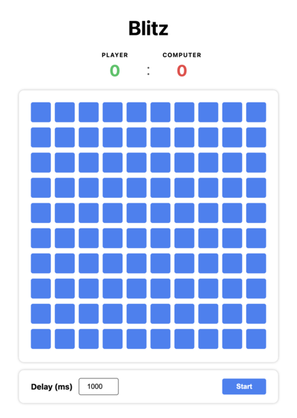

# Angular Mini Games


A collection of interactive mini-games built with Angular 21.

**Live demo:** [alexkhorunzhii-ux.github.io/ng-mini-games](https://alexkhorunzhii-ux.github.io/ng-mini-games/)

## Blitz



An interactive reaction mini-game — click the highlighted cell before the timer runs out. First to 10 points wins.

### Game Rules

- Click **Start** to begin. A random cell turns **yellow** — click it within the time limit.
- Click it in time → cell turns **green**, you score a point.
- Miss it → cell turns **red**, the computer scores a point.
- First to **10 points** wins. A result screen is shown at the end.

### Configuration

Adjust game parameters in [`src/app/features/blitz/blitz.config.ts`](src/app/features/blitz/blitz.config.ts):

| Constant                    | Default | Description                  |
|-----------------------------|---------|------------------------------|
| `BLITZ_DEFAULT_INTERVAL_MS` | `1000`  | Time limit per cell (ms)     |
| `BLITZ_WIN_SCORE`           | `10`    | Points required to win       |
| `BLITZ_BOARD_SIZE`          | `10`    | Board dimensions (N×N grid)  |

## Getting Started

### Prerequisites

- Node.js 18+
- npm 9+

### Development

Install dependencies:

```bash
npm install
```

Start the dev server at [http://localhost:4200](http://localhost:4200):

```bash
npm start
```

Run tests:

```bash
npm test
```

Build for production:

```bash
npm run build
```

## Tech Stack

- Angular 21 (zoneless, standalone components)
- NgRx SignalStore
- TypeScript
- SCSS with CSS custom properties

## License

MIT
